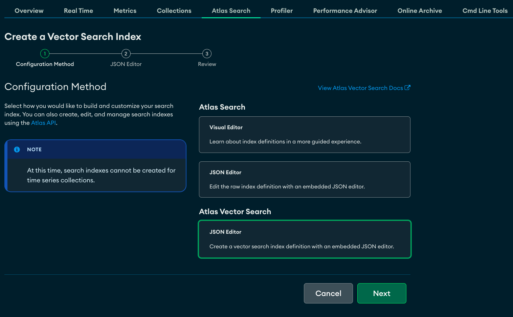
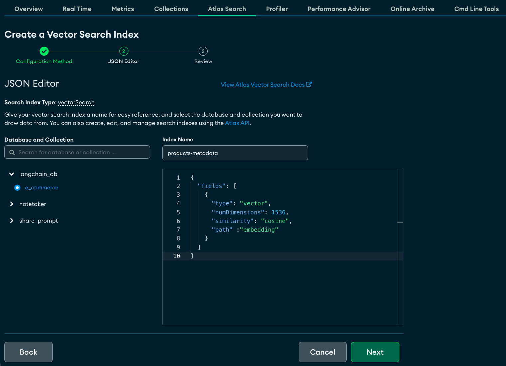

# amazon-bedrock-genai-chatbot

This repository contains code samples for a chatbot using Amazon Bedrock, LangChain & MongpDB Atlas Vector Search.

### Gain Model Access from Amazon Bedrock Console

Visit the [Amazon Bedrock documentation](https://docs.aws.amazon.com/bedrock/latest/userguide/model-access.html) for instructions on gaining model access. For Claude access, use the `us-east-1` or `us-west-2` region. 

> NOTE: This codebase uses the region `us-west-2`. Please update the region in the `.env` file if using another region.

### Create MongoDB instance 

Create a MongoDB instance by following the instructions in [the documentation](https://www.mongodb.com/basics/create-database).  Note down the host, username, and password.

> &#x26a0;&#xfe0f; **Pay attention to the network setup. If you are using SageMaker studio to go along with this tutorial, you will need to expose the MongoDB instance to the internet.**

1. Create a database called `langchain_db` with a collection called `e_commerce` in MongoDB Atlas in the "Collections" tab of your cluster.

2. Then, in the "Atlas Search" tab, create an index, with the following configuration:





Use the database and collection from the previous step, and pass in the following JSON into the JSON Editor:

```json
{
  "fields": [
    {
      "type": "vector",
      "numDimensions": 1536,
      "similarity": "cosine",
      "path" :"embedding"
    }
  ]
}
```

### Populate instance with embeddings

1. Create a `.env` file in the root directory and add the following environment variables:

a. The region for Amazon Bedrock as `REGION`

b. The connection string to your MongoDB cluster as `MDB_URI`

c. The database name as `MDB_DATABASE`

d. The collection name as `MDB_COLLECTION`

For example:

```env
REGION=us-west-2
MDB_URI=mongodb+srv://{USERNAME}:{PASSWORD}@{HOSTNAME}.mongodb.net/?retryWrites=true&w=majority
MDB_DATABASE=langchain_db
MDB_COLLECTION=e_commerce
```

2. Follow the notebook [shopping-bot.ipynb](shopping-bot.ipynb) to download the [product data](https://drive.google.com/file/d/1tHWB6u3yQCuAgOYc-DxtZ8Mru3uV5_lj/view) and embed and store it in MongoDB Atlas Search.

> **Note:** If you are running the notebook in VSCode, also make sure you run `pip install ipykernel`

### Run streamlit application

```bash
streamlit run chatbot_rag.py
```

### Start chatting

While chatting, check your terminal window to see how the chain is running.
> NOTE: Set verbose=False for chain `ConversationalRetrievalChain` in the file [langchain.py](utils/langchain.py) if you dont want to see the detailed output.
