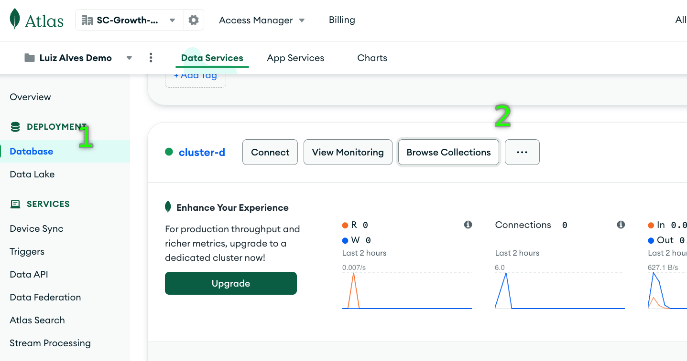

# amazon-bedrock-genai-chatbot

This repository contains code samples for a chatbot using Amazon Bedrock, LangChain & MongpDB Atlas Vector Search.


## Pre-Requisities

You can run this workshop using your own IDE (e.g. VSCode) or through Amazon SageMaker Studio. 


## Gain Model Access from Amazon Bedrock Console

Visit the [Amazon Bedrock documentation](https://docs.aws.amazon.com/bedrock/latest/userguide/model-access.html) for instructions on gaining model access. For Claude access, use the `us-east-1` or `us-west-2` region.

> NOTE: This codebase uses the region `us-west-2`. Please update the region in the `.env` file if using another region.

## Create MongoDB instance

In this section, we will set up a MongoDB Atlas cluster and database cluster. We will launch a cluster using the Atlas console and set up a **free-tier cluster**. You can find more information in [the documentation](https://www.mongodb.com/basics/create-database). However, you

1 - Create an account on [MongoDB Atlas](https://cloud.mongodb.com/) or login with an existing account

2 - Choose Build a Database to start the database configuration. Select the **M0 option from the free tier** and AWS as provider. Set the region to `us-west-2` (or to the region where you run the workshop).

> ℹ️ Note that it's ok to have the MongoDB cluster in a different region (us-east-1) while the codebase uses the region (`us-west-2`)


3 - You should be navigated to the Security Quickstart view. In the Security Quickstart view, create the database Username and Password. You will need them later to set up the connectivity to your cluster. Choose Create User once you defined the credentials.

When being asked about the network access for the connection, keep the selection to My Local Environment and let your local IP, which is added automatically, be appended to the IP Access List.

Choose Finish and Close to finalize the setup.


> ℹ️ If you skip the User creation above, you can create the user using the _"Database Access"_ option on the botton left of Atlas console.

4 - Now go to the _"Network Access"_ option on the botton left, click on _"+ Add IP Address"_, choose the option to _"Allow Access From Anywhere"_, and set this entry to be deleted after the duration of the workshop.

> &#x26a0;&#xfe0f; If you are using SageMaker studio to go along with this tutorial, this will ensure the MongoDB instance is accessible via internet.


5 - Now choose the _"Database"_ option on the left panel, then click on _"Browse Collections"_ of your newly created cluster. (It can take a few minutes for your cluster to become available)



6 - Click on _"Add you Own Data"_ and create a database called `langchain_db` with a collection called `e_commerce`. Leave the additional preferences empty, and click _"Create"_.


7 - Then, in the _"Atlas Search"_ tab, create an index, select the option **"Atlas Vector Search > JSON Editor"**, then click next:


8 - Select the collection `e_commerce` you just created. Set the Index name to `products-metadata` and add the following JSON into the JSON Editor:

```json
{
  "fields": [
    {
      "type": "vector",
      "numDimensions": 1536,
      "similarity": "cosine",
      "path" :"embedding"
    }
  ]
}
```


9 - Last, choose the _"Database"_ option on the left panel, then click on _"Connect"_ buttom of your cluster and follow the instructions `Driver -> Python` to find the connection string.

Note down the connection string to use it later.

## Populate instance with embeddings

In this section, we will convert the text into a vector representation and store them into the MongoDB Atlas Vector index created in the previous section. 

We start by using the correct credentials to access the database, unpacking the dataset and loading it to the vector database.

1. Create a `.env` file in the root directory and add the following environment variables:

a. The region for Amazon Bedrock as `REGION`

b. The connection string to your MongoDB cluster as `MDB_URI`. Write the actual username and password you from the previous step 3.

c. The database name as `MDB_DATABASE`

d. The collection name as `MDB_COLLECTION`

For example:

```env
REGION=us-west-2
MDB_URI=mongodb+srv://{USERNAME}:{PASSWORD}@{HOSTNAME}.mongodb.net/?retryWrites=true&w=majority
MDB_DATABASE=langchain_db
MDB_COLLECTION=e_commerce
```


2. Follow the notebook [shopping-bot.ipynb](shopping-bot.ipynb) to unpack the dataset, and embed and store the dataset in MongoDB Atlas Search.

> **Note:** If you are running the notebook in VSCode, also make sure you run `pip install ipykernel`


Using Amazon SageMaker Studio, this workshop has been tested using the following image and instance type. 


Please wait as SageMaker initialize the kernel.

After sucessfully loading the kernel, you should see the kernel details as indicated below. 


## Run streamlit application

```bash
streamlit run chatbot_rag.py
```

### Start chatting

While chatting, check your terminal window to see how the chain is running.
> NOTE: Set verbose=False for chain `ConversationalRetrievalChain` in the file [langchain.py](utils/langchain.py) if you dont want to see the detailed output.
